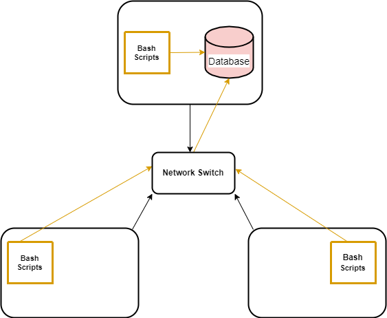

# Linux Cluster Monitoring Agent

## Introduction
The Linux Cluster Monitoring Agent project consists of building a system for the administration of a [Linux Cluster](https://en.wikipedia.org/wiki/Linux-HA). To this end, data on hardware specifications and resource usage of each node/server in the cluster is collected using bash scripts. The data is saved in an RDBMS database which can be queried using SQL scripts. The database is stored in a `PostgreSQL` server provisioned using `Docker`. `Git` and `GitHub` were used for version control. A Linux Cluster administrator can use this system to gather useful information on the servers to help determine whether nodes need to be added or removed from the system among other things. SQL queries can be run to determine information such as which node uses the most memory, what the average CPU usage is for a certain time interval, which server has the least disk storage available, or what the CPU architecture is for a given node.

## Implemenation
Below is a breakdown of how the system is implemented.

### Architecture


### Database Schema
The database that is used for this system was named `host_agent` and is stored in `PostgreSQL` which was provisioned using `Docker`. It contains two tables:  `host_info` and `host_usage`. Data for hardware specifications for each node is stored in `host_info`, whilst information on resource usage for each node is stored in `host_usage`. The schema of these tables is as follows:

#### `host_info`
- `host_id`: unique id number for host
- `hostname`: name of host
- `cpu_number`: Number of cores
- `cpu_architecture`: CPU architecture
- `cpu_model`: CPU model name
- `cpu_mhz`: CPU frequency in Mhz
- `L2_cache`: cache in KB
- `total_mem`: total memory in KB
- `timestamp`: time data was collected in UTC time zone

#### `host_usage`
- `timestamp`: time data was collected in UTC time zone
- `host_id`: host_id from `hosts` table
- `memory_free`: free memory in MB
- `cpu_idle`=95 CPU idle in percentage
- `cpu_kernel`: kernel usage in percentage
- `disk_io`: number of disk I/O
- `disk_available`: root directory available disk 

### Scripts
- `psql_docker.sh`: creates/starts/stops a psql instance.
- `ddl.sql`: creates database tables.
- `host_info.sh`: inserts host hardware specifications data into `host_info` table. Only done once since this data is static.
- `host_usage.sh`: inserts host resource usage data into `host_usage` table. This is done at regular intervals using a `crontab` job.
- `crontab`: runs `host_usage.sh` at regular intervals.
- `queries.sql`: 1. Groups hosts by CPU number and orders them by memory size. 2. Displays average memory usage for 5 minute-intervals. 3. Detects host failure.

## Usage
1. Start a psql instance using psql_docker.sh. Run the folowing command:
```bash
#start a psq instance
bash ./linux_sql/scripts/psql_docker.sh start
```
2. Create tables using ddl.sql
```bash
#replace psql_host, psql_user, and db_name accordingly
psql -h psql_host -U psql_user -d db_name -f ./linux_sql/sql/ddl.sql
```
3. Add hardware specs data to the database using host_info.sh
```bash
#replace psql_host, psql_port, db_name, psql_user, and psql_password accordingly 
bash ./linux_sql/scripts/host_info.sh psql_host psql_port db_name psql_user psql_password
```
4. Add hardware usage data to the database using host_usage.sh
```bash
#replace psql_host, psql_port, db_name, psql_user, and psql_password accordingly 
bash ./linux_sql/scripts/host_usage.sh psql_host psql_port db_name psql_user psql_password
```
5. Crontab setup
```bash
#edit crontab jobs
bash crontab -e

#insert the following into the crontab file (without the quotation marks).
#press 'i' to insert
#replace psql_host, psql_port, db_name, psql_user, and psql_password accordingly
"* * * * * bash ./linux_sql/scripts/host_usage.sh psql_host psql_port db_name psql_user psql_password > /tmp/host_usage.log"

#save and exit (press 'Esc' then ':wq' then 'Enter')

#list crontab jobs
bash crontab -l

```
6. Run SQL queries in the `queries.sql`. Use the following command:
```bash
#replace psql_host, psql_user, and db_name accordingly
psql -h psql_host -U psql_user -d db_name -f ./linux_sql/sql/queries.sql
```

## Test
The system was tested using a single machine. The scripts and queries produced desired and expected results.

## Deployment
This project was deployed using the following tools: `GitHub`, `Docker`, and `crontab`.

## Improvements
- Automatically generate resource usage reports
- Make suggestions on node addition/removal
- Add a UI
